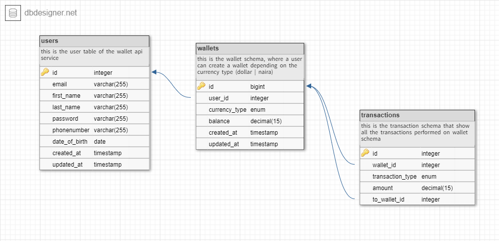

# wallet service(lendsqr backend test)

This is a wallet service api that is created for the backend test of lendsqr. This api is a simple wallet service, where a user can be able to fund their account, transfer funds and withdraw funds from their account

  <!--[](https://opencollective.com/nest#backer)
  [](https://opencollective.com/nest#sponsor)-->

## Description

The wallet service api is a simple api that enable a user to create wallets for funding, receiving and transfering funds from one user wallet to another. From this backend api wallet service that can be consumed, a user can create mutiple wallets depending on the currency type specific when creating the wallet.

A user can have at most two wallet, which is a dollar and naira wallet, user can fund their wallet by specifying the currency type. example is getting a balance of a user by specifying the currency type

```
request - http://localhost/balance/1/?currency_type=dollar
```

This api endpoint obtain the balance of a user wallet base on the currency type specified.

## schema



this schema show the relationship between tables and how the api service works on the database layer.

## Api documentation

wallet service api is a simple to use api, below are the endpoint available in the walllet service api. relative url should be appended to the baseurl when making api calls.

base url: http://localost/api

### OnBoarding a user

```
route  - /user/register (POST) request
```

### getting api key to authenticate the api

```
route - /user/api_key (POST) request
```

### creating a wallet

```
route - /wallet/create (POST) request
```

### fund a user wallet

```
route - /wallet/fund (PUT) request
```

### transfer funds from user wallet

```
route - /wallet/transfer (PUT) request
```

### withdraw funds from user wallet

```
route - /wallet/withdraw (PUT) request
```

### get all user wallets

```
route - /wallet/all/:user_id (GET) request
```

### get user balance of wallet base on the currency type

```
route - /user/balance/:user_id?currency_type=<currency_type(dollar | naira)> (GET) request
```

### get all transactions of wallets

```
route - /wallets/transactions (GET) request
```

## Api Examples

## Stay in touch

- Author - Omorisiagbon Abraham
- linkedin - [https://www.linkedin.com/in/abraham-omorisiagbon-619796233/](https://www.linkedin.com/in/abraham-omorisiagbon-619796233/)
- Twitter - [abrahamoz\_](https://x.com/abrahamoz_)

## License

lendsqr wallet service backend test is [MIT licensed](LICENSE).
